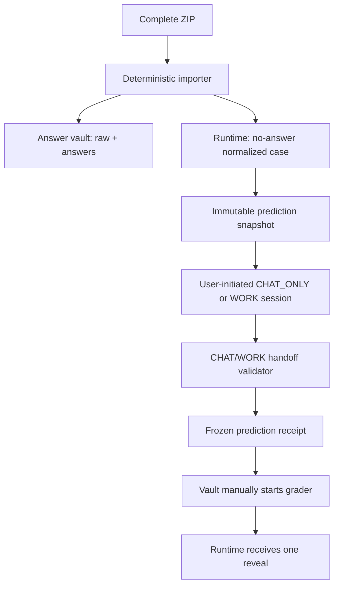

# Fortune V1 automation runtime

Repository-driven, answer-isolated orchestration for **紫微斗数＋四柱八字综合相对预测**. V1 automates deterministic ingest, immutable snapshots, run validation, freeze/reveal ordering, literal answer replay, scoring, patch leak scanning, regression selection, state transitions, and audit reporting. It does not pretend that a CHAT continues reasoning after the response ends.

## Execution model

The prediction engine is the active ChatGPT project session in either:

- `CHAT_ONLY` — the normal and preferred operating mode;
- `WORK` — an optional higher-capacity interactive mode when available.

No OpenAI API key, separate model endpoint, paid server, or background process is required. GitHub does not start ChatGPT autonomously. The user starts each new case conversation, ChatGPT performs the dual-track reasoning, and the repository validates and freezes the resulting `PREDICTION-RUN-V1` object.

## Installation state

The authoritative state is the current machine-generated `reports/install-receipt.json`. The installed components include:

- the S00–S19 source baseline and exact S19 binding-table recomputation;
- the R16 main-prompt audit snapshot, explicitly marked as an audit copy rather than runtime authority;
- the physically separate answer vault and reverse-grading workflow;
- bidirectional token-scope denial and absence of any vault credential in the runtime repository;
- static and synthetic validation;
- the `CHAT_WORK_INTERACTIVE_EXECUTOR` registration;
- the deterministic `fortune-v1 chat-work-import` handoff adapter;
- the `chat-work-handoff` GitHub workflow, which validates and freezes a prediction before reveal.

The phrase `EXTERNAL_PREDICTION_RUNNER` in the installation schema now refers to the **external-to-GitHub ChatGPT project session**, not to an API service. See [external-runner.md](docs/external-runner.md).

Transport suffixes such as `(8)`, `(9)` and `(59)` are never source identity. The importer reads the first active internal `LIBRARY_ID`, raw SHA256 and size, then selects only the version bound by the first current S19 table. Non-active byte versions are historical/quarantine records.

## Security boundary



The runtime repository has no vault credential and no workflow that checks out the vault. On GitHub Free private repositories, the answer vault manually dispatches reverse grading with `RUNTIME_REPO_TOKEN`, scoped only to the runtime repository. Paid branch/ruleset/environment protections are recorded as unavailable, never as PASS.

## Quick start

```bash
./scripts/install.sh
PYTHONPATH=src python -m fortune_v1.cli --help
```

Import, normalize, audit and migrate the one source ZIP:

```bash
PYTHONPATH=src python -m fortune_v1.cli import-source-package \
  --package /path/to/fortune-source-baseline-S00-S19-R16.zip \
  --expected-zip-sha256 4bd8bf03cceeb2ca03d096fbebda9f4174f2e9f7879667bef228acd2770b09be \
  --config config/runtime.json \
  --work-root .source-import-work \
  --reports-dir reports \
  --migrate-destination knowledge/base
```

See [operations.md](docs/operations.md), [architecture.md](docs/architecture.md), and [external-runner.md](docs/external-runner.md).

## Immutable object layers

1. `RAW_PACKAGE` — vault-only original ZIP and members.
2. `NORMALIZED_CASE` — deterministic classification result; runtime copy omits answer details.
3. `PREDICTION_INPUT_SNAPSHOT` — the only case object visible to prediction.
4. `PREDICTION_RUN` — TOP1/TOP2, two local seals, coverage, evidence ledger, direction matrix and all pairwise rows.
5. `REVEAL_AND_DIAGNOSIS` — literal replay and TOP1 scoring; never overwrites the run.
6. `PATCH_AND_REGRESSION` — candidate patch, leak scan and zero-damage regression decision.

Every rerun requires a new `RUN_ID`; existing run paths are rejected.

The answer-vault initialization template is under `templates/answer-vault/`. Its generated ZIP is an installation package only; it contains no real answers, real examples, token value, prior prediction or SHADOW_REBUILD payload.
