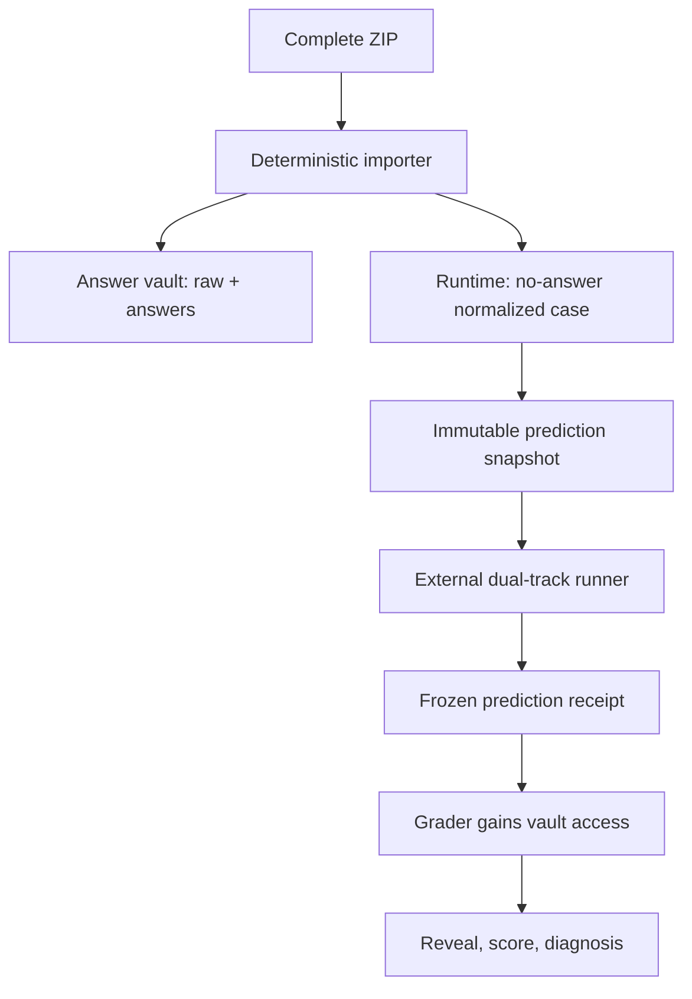

# Fortune V1 automation runtime

Repository-driven, answer-isolated orchestration for **紫微斗数＋四柱八字综合相对预测**. V1 automates deterministic ingest, immutable snapshots, run validation, freeze/reveal ordering, literal answer replay, scoring, patch leak scanning, regression selection, state transitions, and audit reporting. It does not pretend that a CHAT continues reasoning after the response ends.

## Current verified status

`AUTOMATION_RUNTIME_INSTALL_STATUS=SCHEMA_DEFINED_NOT_INSTALLED`

This status is intentionally unchanged until all of these are true in one installation receipt:

- S00–S19 are present as unique original byte streams and the S19 S00–S18 binding table recomputes exactly.
- A main-prompt audit snapshot exists and is explicitly marked as an audit copy, not runtime authority.
- `fortune-runtime` and `fortune-answer-vault` are separate private repositories with distinct prediction/grader identities.
- Static and synthetic end-to-end tests pass from an immutable commit.
- A real external prediction runner is installed.

The current upload audit is expected to HOLD because S00, S01, S16, S18 and S19 are absent and S02 is duplicated. No source is silently chosen.

## Security boundary



The prediction identity must not be installed on the vault repository. The grading workflow checks the freeze receipt before it checks out the vault. Local directories alone do not prove physical isolation because one OS user may read both.

## Quick start

```bash
./scripts/install.sh
PYTHONPATH=src python -m fortune_v1.cli --help
```

Audit source bytes without migrating them:

```bash
PYTHONPATH=src python -m fortune_v1.cli audit-sources \
  --source-dir /path/to/current-S00-S19 \
  --config config/runtime.json \
  --output reports/source-audit.json
```

Migration is fail-closed and only runs after that report is `PASS`:

```bash
PYTHONPATH=src python -m fortune_v1.cli migrate-sources \
  --audit reports/source-audit.json \
  --destination knowledge/base
```

See [operations.md](docs/operations.md) for the complete lifecycle and [architecture.md](docs/architecture.md) for object and permission design.

## Immutable object layers

1. `RAW_PACKAGE` — vault-only original ZIP and members.
2. `NORMALIZED_CASE` — deterministic classification result; runtime copy omits answer details.
3. `PREDICTION_INPUT_SNAPSHOT` — the only case object visible to prediction.
4. `PREDICTION_RUN` — TOP1/TOP2, two local seals, coverage, evidence ledger, direction matrix and all pairwise rows.
5. `REVEAL_AND_DIAGNOSIS` — literal replay and TOP1 scoring; never overwrites the run.
6. `PATCH_AND_REGRESSION` — candidate patch, leak scan and zero-damage regression decision.

Every rerun requires a new `RUN_ID`; existing run paths are rejected.

