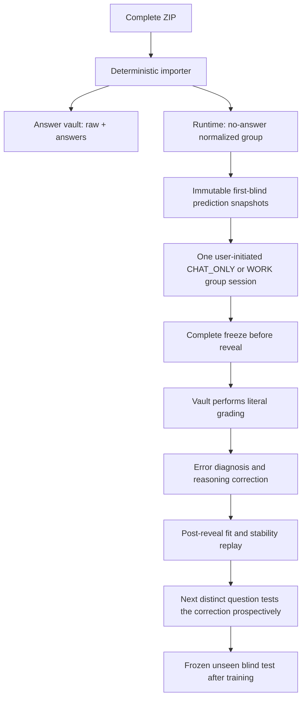

# Fortune V1 automation runtime

Repository-driven, answer-isolated orchestration for **紫微斗数＋四柱八字综合相对预测**. V1 automates deterministic ingest, immutable snapshots, run validation, group freeze/reveal ordering, literal answer replay, scoring, iterative reasoning correction, patch leak scanning, regression selection, state transitions, and audit reporting. It does not pretend that a CHAT continues reasoning after the response ends.

> **Current release boundary:** R25 C01–C05A repository-delivery and contamination-quarantine interfaces are installed on the development branch only. Training scoring and the 25-question clean retest remain blocked until full immutable-checkout readback, a full repository contamination inventory, one real repository-only shadow run, causal-use PASS, no-fallback PASS and fresh answer isolation all pass. `FORMAL_RELEASE=NO`; no predictive improvement is claimed. Implementation summary object: `1e27934cc7e22cea6a9aa6911f1877d27a3172003bbcfeb51abf23b5385d74c1`.

Audit dependencies are one-way: the R25 master plan binds the implementation summary, and the summary binds component receipts. Component receipts do not link back to the summary, preventing cyclic object-hash invalidation.

## Execution model

The prediction engine is the active ChatGPT project session in either:

- `CHAT_ONLY` — the normal and preferred operating mode;
- `WORK` — an optional higher-capacity interactive mode when available.

No OpenAI API key, separate model endpoint, paid server, or background process is required. GitHub does not start ChatGPT autonomously. The user starts one frozen training-group conversation, ChatGPT processes every answer-free case in that group with fresh per-case isolation, and the repository validates and freezes the resulting child `PREDICTION-RUN-V1` objects under one `GROUP-TRAINING-RUN-V1`.

`CHAT_STATELESS_COLD_START` applies between groups, not between cases within one group. The fixed development group may therefore run five cases and 25 questions continuously in one CHAT/WORK session without five new conversations or five separate continue commands.

## Learning and scoring model

Revealed development examples are training material. An incorrect answer is used to diagnose and correct the reasoning path; it is never erased or converted into a retrospective blind success.

The active sequence is:

> **汲取 → 拆解 → 填充 → 重塑 → 化用 → 生发**

The corrected `LEARNING-CYCLE-V2.2` rules are:

- each distinct question contributes at most one accuracy observation: its immutable first prediction made before reveal;
- post-reveal replays measure training fit and execution stability only;
- repeating one revealed question five times cannot be reported as 80% or 100% blind accuracy;
- a question advances after its error diagnosis, reusable reasoning correction, counterexample tests, provenance, pairwise replay, and clean stability checks complete;
- rolling TOP1/TOP2 are calculated only across distinct questions' first-blind predictions and are not evaluated before five distinct questions;
- unseen generalization requires a later frozen block that was never used to create or revise the method;
- historical reports, revealed-case traces, `SHADOW_REBUILD`, training state and unpromoted research hypotheses are audit/research objects, not active runtime knowledge.

The repository therefore distinguishes first-blind accuracy, post-reveal training fit, replay stability, and unseen generalization. See [learning-cycle-v2.md](docs/learning-cycle-v2.md).

## Installation state

The authoritative runtime state is the machine-generated `reports/install-state.json`, validated by `reports/install-state-validation.json` and bound to the versioned installation receipt. Installed components include:

- the S00–S19 source baseline and exact S19 binding-table recomputation;
- the R16 main-prompt audit snapshot, explicitly marked as an audit copy rather than runtime authority;
- the physically separate answer vault and reverse-grading workflows;
- bidirectional token-scope denial and absence of any vault credential in the runtime repository;
- static and synthetic validation;
- the `CHAT_WORK_INTERACTIVE_EXECUTOR` registration;
- the deterministic single-case `fortune-v1 chat-work-import` handoff adapter;
- the installed group commands `fortune-v1 group-chat-work-run` and `fortune-v1 group-verify-freeze`;
- the corrected learning command `fortune-learning-cycle`;
- complete-group freeze before any answer access;
- the answer-vault `grade-frozen-group` workflow for one-dispatch whole-group reveal and per-case literal grading;
- versioned knowledge, method and model release interfaces;
- source-packet, method-packet and causal-use validation interfaces;
- the C05A legacy-contamination quarantine gate defined by `governance/runtime-contamination-policy-v1.json`.

The phrase `EXTERNAL_PREDICTION_RUNNER` in the installation schema refers to the **external-to-GitHub ChatGPT project session**, not to an API service. See [external-runner.md](docs/external-runner.md).

Transport suffixes such as `(8)`, `(9)` and `(59)` are never source identity. The importer reads the first active internal `LIBRARY_ID`, raw SHA256 and size, then selects only the version bound by the first current S19 table. Non-active byte versions are historical/quarantine records.

## Security boundary



The runtime repository has no vault credential and no workflow that checks out the vault. On GitHub Free private repositories, the answer vault manually dispatches reverse grading with `RUNTIME_REPO_TOKEN`, scoped only to the runtime repository. Paid branch/ruleset/environment protections are recorded as unavailable, never as PASS.

A repository-bound source packet or prediction that references project uploads, answer-vault paths, historical `reports/`, `data/training/`, post-reveal objects, `SHADOW_REBUILD`, or unpromoted research hypotheses fails closed and is score-ineligible. Historical objects remain immutable for audit; they are not silently erased or permitted to re-enter through narrative citation.

## Quick start

```bash
./scripts/install.sh
PYTHONPATH=src python -m fortune_v1.cli --help
fortune-learning-cycle --help
fortune-repository-delivery --help
```

Import, normalize, audit and migrate the one source ZIP:

```bash
PYTHONPATH=src python -m fortune_v1.cli import-source-package \
  --package /path/to/fortune-source-baseline-S00-S19-R16.zip \
  --expected-zip-sha256 4bd8bf03cceeb2ca03d096fbebda9f4174f2e9f7879667bef228acd2770b09be \
  --config config/runtime.json \
  --work-root .source-import-work \
  --reports-dir reports \
  --migrate-destination knowledge/base
```

Build or validate the contamination boundary:

```bash
fortune-repository-delivery contamination-inventory \
  --repository-root . \
  --output reports/runtime-contamination-inventory.json

fortune-repository-delivery contamination-validate \
  --input data/contracts/<run-id>.json \
  --output reports/runtime-contamination-validation.json
```

Run one complete answer-free training group in one active CHAT/WORK session only after all repository-delivery gates permit it:

```bash
fortune-v1 group-chat-work-run \
  --manifest data/group-submissions/<group-run-id>.json \
  --group-root data/dev-groups/<group-id> \
  --output-root data/group-runs \
  --mode CHAT_ONLY \
  --session-id <session-id> \
  --group-run-id <new-group-run-id>
```

See [operations.md](docs/operations.md), [architecture.md](docs/architecture.md), [external-runner.md](docs/external-runner.md), [group-training-single-session.md](docs/group-training-single-session.md), and [learning-cycle-v2.md](docs/learning-cycle-v2.md).

## Immutable object layers

1. `RAW_PACKAGE` — vault-only original ZIP and members.
2. `NORMALIZED_CASE` — deterministic classification result; runtime copy omits answer details.
3. `PREDICTION_INPUT_SNAPSHOT` — the only case object visible to prediction.
4. `PREDICTION_RUN` — TOP1/TOP2, two local seals, coverage, evidence ledger, direction matrix and all pairwise rows.
5. `GROUP_PREDICTION_FREEZE` — every expected child run and hash, complete before any answer reveal.
6. `REVEAL_AND_DIAGNOSIS` — literal replay and TOP1 scoring; never overwrites the run.
7. `REASONING_CORRECTION` — error decomposition, general method candidate, conditions, counterexamples and source parents.
8. `POST_REVEAL_TRAINING_REPLAY` — training fit and stability only; never blind accuracy.
9. `DISTINCT_FIRST_BLIND_LEDGER` — one pre-reveal observation per question for rolling TOP1/TOP2.
10. `UNSEEN_BLIND_TEST` — frozen evaluation performed only after training completion.

Every rerun requires a new `GROUP_RUN_ID` and new child `RUN_ID` values; existing run paths are rejected.

The answer-vault initialization template is under `templates/answer-vault/`. Its generated ZIP is an installation package only; it contains no real answers, real examples, token value, prior prediction or `SHADOW_REBUILD` payload.
