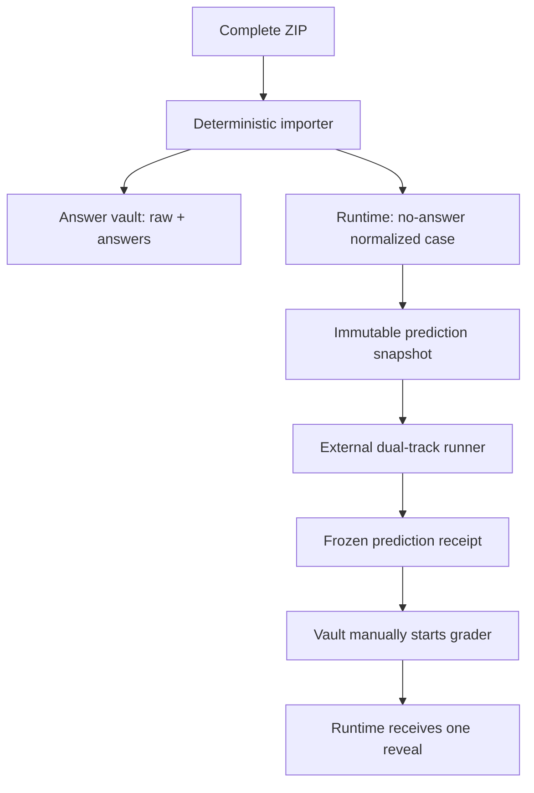

# Fortune V1 automation runtime

Repository-driven, answer-isolated orchestration for **紫微斗数＋四柱八字综合相对预测**. V1 automates deterministic ingest, immutable snapshots, run validation, freeze/reveal ordering, literal answer replay, scoring, patch leak scanning, regression selection, state transitions, and audit reporting. It does not pretend that a CHAT continues reasoning after the response ends.

## Current verified status

`AUTOMATION_RUNTIME_INSTALL_STATUS=SCHEMA_DEFINED_NOT_INSTALLED`

The repository, source baseline, prompt audit snapshot, reverse-grading topology, answer-vault workflow, token-scope proofs and deterministic validation chain are installed and machine-checked. The repository-side external-runner adapter is also installed and covered by tests. Formal installation still cannot advance until a **real separate no-answer dual-track prediction executor** is bound and passes one fresh unrevealed DEV activation run.

The final unresolved gate is therefore:

```text
EXTERNAL_PREDICTION_RUNNER=NOT_INSTALLED
```

This status must not be changed by filling configuration fields, replaying a fixture or manufacturing a prediction object. See [external-runner.md](docs/external-runner.md) and [remaining-installation-gates.json](reports/remaining-installation-gates.json).

The completed gates include:

- S00–S19 are present as unique original byte streams and the S19 S00–S18 binding table recomputes exactly.
- The exact R16 main-prompt audit snapshot is recorded as an audit copy, not runtime authority.
- `ziwei-bazi-model` and `fortune-answer-vault` are separate private repositories with bidirectional token-scope denial proved by machine probes.
- The answer-vault reverse-grading workflow is installed and read back by hash.
- Static and synthetic tests pass from immutable commits.
- The runtime repository has no vault credential and no workflow that checks out the vault.
- A fail-closed external-runner HTTP adapter validates outbound answer isolation and inbound `PREDICTION-RUN-V1` objects.

Transport suffixes such as `(8)`, `(9)` and `(59)` are never source identity. The importer reads the first active internal `LIBRARY_ID`, raw SHA256 and size, then selects only the version bound by the first current S19 table. Non-active byte versions are historical/quarantine records.

## Security boundary



The runtime repository has no vault credential and no workflow that checks out the vault. On GitHub Free private repositories, the answer vault manually dispatches reverse grading with `RUNTIME_REPO_TOKEN`, scoped only to the runtime repository. Paid branch/ruleset/environment protections are recorded as unavailable, never as PASS.

## Quick start

```bash
./scripts/install.sh
PYTHONPATH=src python -m fortune_v1.cli --help
```

Import, normalize, audit and migrate the one source ZIP:

```bash
PYTHONPATH=src python -m fortune_v1.cli import-source-package \
  --package /path/to/fortune-source-baseline-S00-S19-R16.zip \
  --expected-zip-sha256 4bd8bf03cceeb2ca03d096fbebda9f4174f2e9f7879667bef228acd2770b09be \
  --config config/runtime.json \
  --work-root .source-import-work \
  --reports-dir reports \
  --migrate-destination knowledge/base
```

See [operations.md](docs/operations.md) for the complete lifecycle and [architecture.md](docs/architecture.md) for object and permission design.

## Immutable object layers

1. `RAW_PACKAGE` — vault-only original ZIP and members.
2. `NORMALIZED_CASE` — deterministic classification result; runtime copy omits answer details.
3. `PREDICTION_INPUT_SNAPSHOT` — the only case object visible to prediction.
4. `PREDICTION_RUN` — TOP1/TOP2, two local seals, coverage, evidence ledger, direction matrix and all pairwise rows.
5. `REVEAL_AND_DIAGNOSIS` — literal replay and TOP1 scoring; never overwrites the run.
6. `PATCH_AND_REGRESSION` — candidate patch, leak scan and zero-damage regression decision.

Every rerun requires a new `RUN_ID`; existing run paths are rejected.

The answer-vault initialization template is under `templates/answer-vault/`. Its generated ZIP is an installation package only; it contains no real answers, real examples, token value, prior prediction or SHADOW_REBUILD payload.
