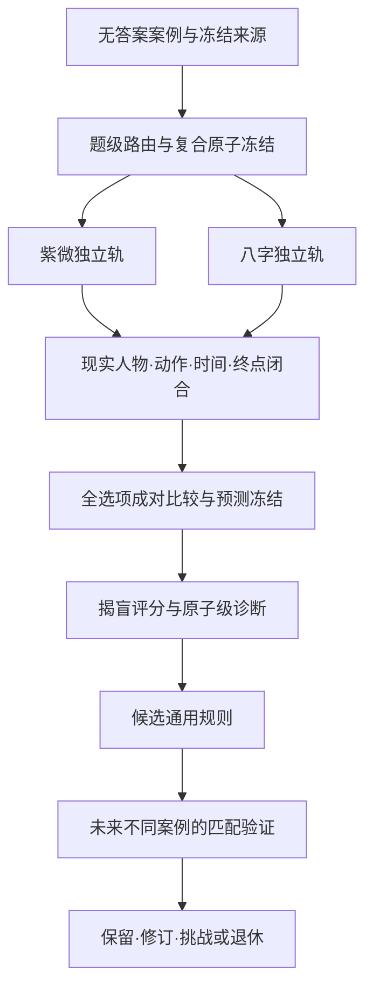

# 可持续成长命理预测模型 V3

## 目标

本项目不是在普通Chat中重新训练基础大模型参数，而是构建一套外部、可积累、可审计、可迁移验证的推理系统。模型成长发生在三个地方：问题路由更准确、推理程序更稳定、通用规则在未来不同案例中获得支持或反例。

## 当前R2训练单位

运行单位是一个完整案例，诊断单位是每一道题。每轮必须完成本案全部题；少于5题全对、5题及以上达到向上取整80%才算本轮达标。每个新案首次盲测只计一次；3个不同新案连续达标才通过阶段门，任一新案失败则归零。失败案在通用复盘后进入间隔复训队列，至少隔开5个新案再验证修复；复训不计首次盲测或晋级证据。整案阈值不能掩盖错题，也不能证明某个主题已经成熟。

每道题在揭盲前固定：

- 主题、人物、时间范围和现实终点；
- 复合选项的判断原子；
- 紫微与八字来源路线；
- 本轮实际采用的通用规则；
- Top1、Top2、最强反证与置信度。

揭盲后，整题仍按Top1等权评分；诊断同时记录是哪个判断原子、哪个时间阶段或哪个人物路线出错。第二轮以后不计新的首次盲测准确率，但必须重新推理，不能复述旧预测或记答案。

## 数据分区

完整题库为107例、511题。例题98已由用户补传的完整原文修复，107例全部通过输入门，并按人物身份指纹和题目覆盖分为：

| 分区 | 案例数 | 用途 | 是否可产生新规则 |
|---|---:|---|---|
| DEVELOPMENT | 65 | 其中63例进入干净首次盲测；例题1为揭盲历史，例题29为来源暴露参考 | 可以 |
| STAGE_VALIDATION | 21 | 验证已经存在且预测前声明使用的规则 | 不可以立即反向造规则 |
| FINAL_HOLDOUT | 21 | 阶段性最终检验，模型冻结后才开放 | 不可以 |
| BLOCKED | 0 | 输入损坏时整例阻塞；当前没有阻塞案例 | 不适用 |

原有1–5例固定留在开发区；只有已经揭盲和重放过的例题1属于历史样本，例题2–5在答案仍隔离的前提下可保留一次首次盲测资格。例题29的两个完整选项已出现在S01方法说明中，因此只作开发参考，不计干净首次盲测。已经揭盲、重放或被来源文本显著暴露的题永远不能重新成为独立验证样本。

## 端到端流程

## 通用模型学习

失败后必须形成可推广的模型修正并在后续新案激活；修正只改变知识调用顺序、证据权重、适用边界、反证程序和能力上限，不改变S00–S19。预测前没有真正使用的规则不得在事后领取功劳。同案间隔复训可以检验执行是否改善，但不构成新的独立样本；敏感或高方差主题永久保留更严格的样本不足说明。

## 每题推理协议

1. 冻结输入，先拆题干与四个选项的共同原子、区别原子和隐藏负担。
2. 不看答案地建立人物、主题、参考期和现实终点。
3. 紫微先完成本命结构，再按需要加入大限、流年、流月。
4. 八字先完成月令气势、结构和承载，再加入大运、流年、流月。
5. 两轨不得互抄理由；一轨无能力时局部弃权。
6. 把命理象义闭合为同一主体、动作、对象、时间和结果。
7. 对所有选项生成成对比较，重点挑战临时第一与最强竞争项。
8. 冻结Top1/Top2、最强反证和置信度后才可揭盲。

## 错误分类

每次错题至少定位到以下一项：输入识别、题目路由、人物太极、本命结构、岁运应期、现实语义、量级/地域时代、紫微八字裁决、复合选项拆解、最强竞争比较、执行遗漏或不确定度校准。复盘不能只写“某星等于答案”或“以后选另一个字母”。

## Chat＋Work运行

Chat是主要推理界面，只读取单个安全启动包，完成当前轮预测、揭盲后的诊断和通用规则草案。Work负责冻结/评分、失败归零、模型学习、验证、Git提交和重大维护。Work额度不足时使用Chat＋GitHub Issue单次粘贴通道；用户不需要运行终端命令。

## 还必须补上的研究治理

1. **答案可靠性**：正式答案也可能有误或含多种解释，需保存答案来源、置信度和争议状态。
2. **样本选择偏差**：教学例题常偏好戏剧性事件，不能据此推断真实人群中的基础发生率。
3. **地域时代校准**：港币、台币、马币、不同年代学历/住房/职业量级必须按参考期解释。
4. **置信度校准**：除正确率和Top2覆盖率外，长期记录置信度是否与真实命中率一致。
5. **规则回归**：新规则发布前应检查它是否改善匹配题，同时损伤其他已验证能力。
6. **反事实与负例**：不仅收集“有某象且发生”，还需要“有相似象但未发生”的案例来限制规则。
7. **同人泄漏**：相同出生信息或同一人物的不同题必须在同一分区。
8. **敏感属性**：性取向、疾病、死亡、违法和精神状态不得作高确定性标签或单点推断。
9. **停止规则**：样本不足、两轨都无区分能力或选项原文损坏时，应保留强制相对选择与低置信说明，或在数据层阻塞，不能伪装成高质量命理结论。

这些工作决定系统最终是“会复盘的预测模型”，还是只会为教学答案补故事的记忆系统。
